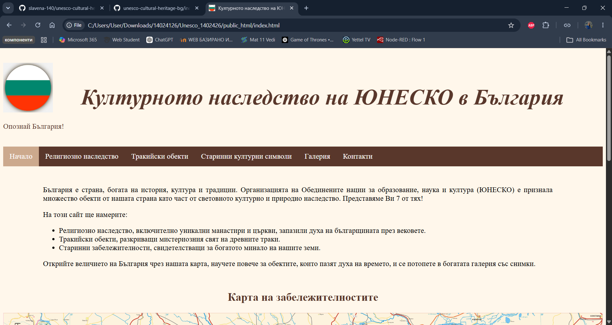
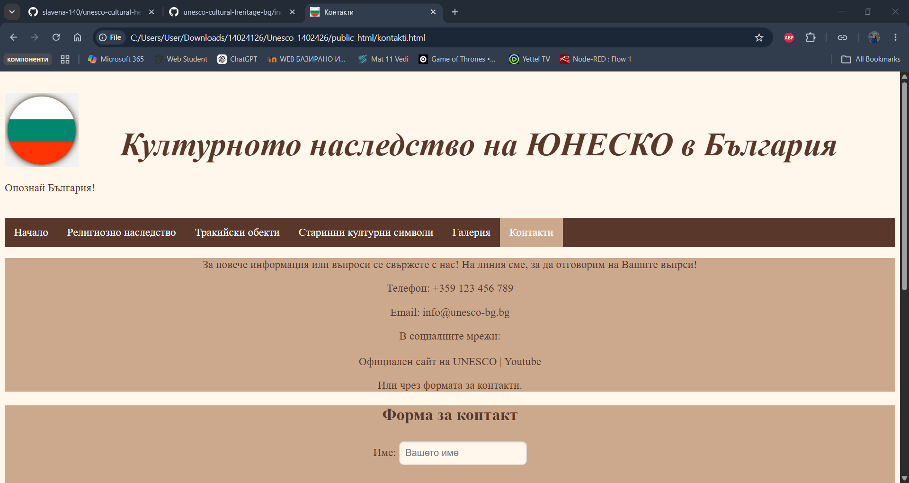

# UNESCO Cultural Heritage in Bulgaria (Responsive Website)

📅 **Date:** 1st Semester (Winter 2024)  
🌱 **Project Status:** Completed (Web Design Academic Project)

An interactive, responsive multi-page educational website dedicated to the 7 major UNESCO cultural heritage sites in Bulgaria. Built from scratch using semantic HTML5, custom CSS3, responsive image mapping, and JavaScript interactive layers.




## 🚀 Features & Interactivity
- **Responsive Image Map:** The homepage features a large map of Bulgaria (`karta.png`) with clickable anchor links mapped directly over the historical sites. A custom JavaScript event listener recalculates the coordinate matrix dynamically when the window is resized.
- **Dynamic Image Gallery:** Integrated jQuery-driven carousel slider (`bxSlider`) with auto-play, touch controls, and pagination indicators for smooth media browsing.
- **Form Validation & Interactive UX:** Full-featured feedback form on the Contact page with strict client-side validation, native email client triggers (`mailto`), and temporary user-state triggers (newsletter prompt on first load).
- **Comprehensive Media Integration:** Embedded scalable YouTube components (`iframe`) and contextual hyperlinked bookings.

## 🛠️ Tech Stack & Methods Used
- **Languages:** HTML5 (Semantic Architecture), CSS3 (Responsive Grid/Media Queries), JavaScript (ES6, DOM Manipulation).
- **Libraries:** jQuery (v3.1.1), bxSlider (v4.2.17 CDN layer).
- **Design Philosophy:** Desktop-first methodology scaling down to 992px (tablets) and 600px (mobile phones) using localized breakpoints.

## 📁 Project Structure
```text
├── images/             # Media and icon assets directory
├── index.html          # Homepage with the responsive geographic map
├── religiozno.html     # Religious heritage text grids & image tables
├── trakijski.html      # Thracian monuments view with interactive hover nodes
├── antichni.html       # Ancient symbols view with structural media frames
├── galeriq.html        # Embedded slider media engine
├── kontakti.html       # Form processing and location reference
├── styles.css          # Responsive design framework & typographic sheets
├── script.js           # Map-matrix calculation and operational loops
└── karta.map           # GIMP Image Map plugin map configuration asset
```
## ⚙️ How to Run the Project Locally
No local servers or compilation frameworks are required.
1. Clone or download this repository to your local machine.
2. Double-click the `index.html` file to open and run the web application directly in any modern web browser (Chrome, Firefox, Safari, Edge).
